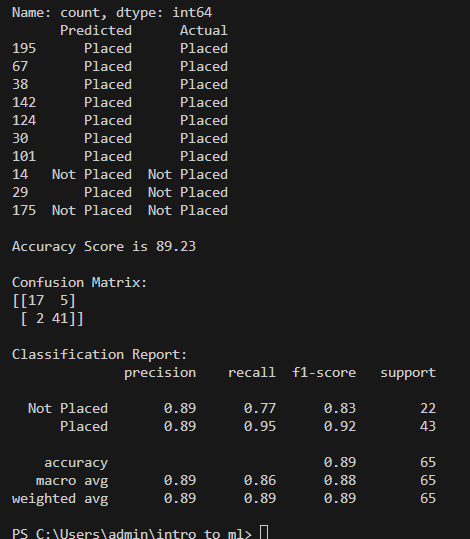

# Implementation-of-Logistic-Regression-Model-to-Predict-the-Placement-Status-of-Student

## AIM:
To write a program to implement the the Logistic Regression Model to Predict the Placement Status of Student.

## Equipments Required:
1. Hardware – PCs
2. Anaconda – Python 3.7 Installation / Jupyter notebook

## Algorithm
1. Import Necessary Packages
2. Fetch the dataset and finalize data and target
3. Build Model and fit data
4. Predict values and evaluate accuracy

## Program:
```
/*
Program to implement the the Logistic Regression Model to Predict the Placement Status of Student.
Developed by: Shri Sai Aravind R
RegisterNumber:  212223040197
*/
```
```py
import numpy as np
import pandas as pd
import matplotlib.pyplot as plt
import seaborn as sns
from sklearn.linear_model import LogisticRegression
from sklearn.model_selection import train_test_split
from sklearn.metrics import accuracy_score, confusion_matrix, classification_report
from sklearn.preprocessing import StandardScaler

def encode(dataframe, cols):
    dataframe = pd.get_dummies(dataframe, columns= cols, drop_first=True)
    return dataframe

df = pd.read_csv("Placement_Data.csv")
print(df.degree_t.value_counts())
print(df.workex.value_counts())
print(df.specialisation.value_counts())
df.drop(["sl_no", "gender","ssc_b","hsc_s","hsc_b", "salary"], axis = 1, inplace=True)

X = df.drop(["status"], axis = 1)
Y = df["status"]

# Encoding categorical Values
X = encode(X,["degree_t" ,"workex","specialisation"] )

# Splitting train and test values, scaling them
xtrain, xtest, ytrain, ytest = train_test_split(X,Y,test_size=0.3, random_state=41)
scaler = StandardScaler()
xtrain = scaler.fit_transform(xtrain)
xtest = scaler.fit_transform(xtest)

# Creating model and fitting data
model = LogisticRegression().fit(xtrain,ytrain)

# Predicting Values and comparing with actual values
ypred = model.predict(xtest)
res_df = pd.DataFrame({"Predicted": ypred[:10],"Actual":ytest[:10]})
print(res_df)

# Accuracy Score, Confusion Matrix and Classification Report
print(f"\nAccuracy Score is {accuracy_score(ytest,ypred)*100:.2f}")
print(f"\nConfusion Matrix: \n{confusion_matrix(ytest,ypred)}")
print(f"\nClassification Report: \n{classification_report(ytest,ypred)}")
```

## Output:



## Result:
Thus the program to implement the the Logistic Regression Model to Predict the Placement Status of Student is written and verified using python programming.
